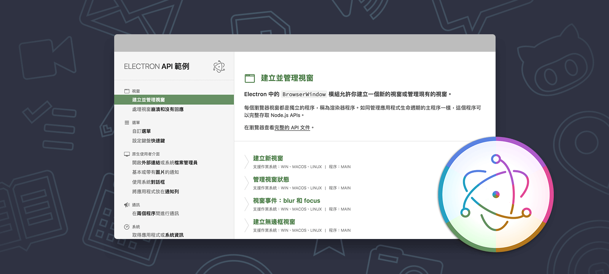

#  Electron API 範例

[](https://travis-ci.org/electron/electron-api-demos)
[](http://standardjs.com)

> 原始專案：[electron-api-demos](https://github.com/electron/electron-api-demos)
>
> 翻譯：[Calvert](https://github.com/CalvertYang) 及 [PJChen](https://github.com/pjchender)

這是一個互動式的桌面應用程式，程式碼範例示範了 [Electron](http://electron.atom.io) API的核心功能。當然，它也是用 Electron 建置的。本應用程式適用於 Windows、macOS 和 Linux 作業系統。

透過這個應用程式，看看你可以用 Electron 做什麼，並使用原始碼來學習如何建立一個基本的 Electron 應用程式。



---

本專案遵守貢獻者公約[行為準則](CODE_OF_CONDUCT.md)。
參與過程中，你必須遵守此準則。若有不能接受的行為，請回報給 electron@github.com。

在 Twitter 跟隨 [@ElectronJS](https://twitter.com/electronjs) 以獲取重要公告，或訪問 [electron 網站](http://electron.atom.io)。

## 使用

你可以針對你的作業系統下載[最新發行版本（英文）](https://github.com/electron/electron-api-demos/releases)或自行建置（詳見下方）。

## 建置

你需要在電腦上安裝 [Node.js](https://nodejs.org) 才能建置此應用程式。

```bash
$ git clone https://github.com/CalvertYang/electron-api-demos-zh-Hant.git
$ cd electron-api-demos-zh-Hant
$ npm install
$ npm start
```

如果你不想 clone，你可以[下載原始碼](https://github.com/CalvertYang/electron-api-demos-zh-Hant/archive/master.zip)。

為了方便開發，你可以使用 DevTools 以全螢幕模式啟動應用程式：

```bash
$ npm run dev
```

## 擴充

 [閱讀文件](docs.md)以了解更多關於如何建立這個應用程式或如何[增加一個新範例](docs.md#加入一個新章節或範例)。
